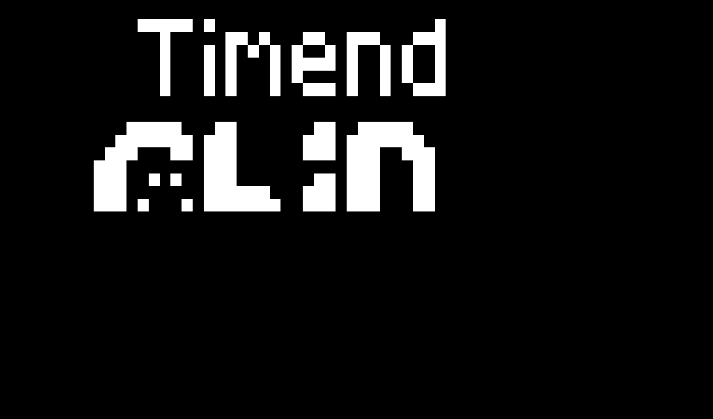

# RSC8

RSC8 is a CHIP-8 virtual machine/emulator written in Rust 🦀

## How to use

```bash
cargo install --git https://github.com/jerryshell/rsc8
```

```bash
rsc8_tui <your_rom.ch8>
```

## Keymap

```text
PC           CHIP-8
--------------------
1 2 3 4      1 2 3 C
Q W E R  =>  4 5 6 D
A S D F      7 8 9 E
Z X C V      A 0 B F
```

Press `ESC` to exit

## Screenshot

chip8-test-suite: CHIP-8 splash screen


chip8-test-suite: IBM logo


chip8-test-suite: Corax+ opcode test


chip8-test-suite: Flags test


chip8-test-suite: Quirks test


chip8-test-suite: Keypad test FX0A


Sierpinski


Tetris


## References

- [CHIP-8 Wikipedia](https://en.wikipedia.org/wiki/CHIP-8)
- [CHIP-8 Research Facility](https://chip-8.github.io)
- [CHIP-8 Test Suite](https://github.com/Timendus/chip8-test-suite)
- [Octo - A CHIP-8 IDE](https://johnearnest.github.io/Octo)

## License

[GNU Affero General Public License v3.0](https://choosealicense.com/licenses/agpl-3.0)
